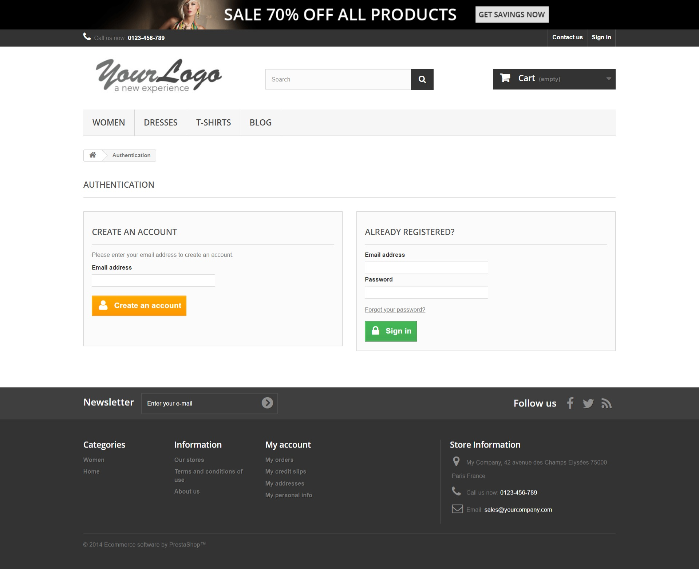

<h1>Testes Automatizados em Página Web</h1>

> Testes para validar cadastro de novo usuário na página de um Ecommerce

<h4>Tecnologias utilizadas</h4>

* Java 

https://www.oracle.com/br/java/technologies/javase/javase8-archive-downloads.html

* JUnit

https://mvnrepository.com/artifact/info.cukes/cucumber-junit 

* Cucumber 

https://mvnrepository.com/artifact/io.cucumber/cucumber-java 

* Selenium 

https://mvnrepository.com/artifact/org.seleniumhq.selenium/selenium-java 

* WebDriver (Chrome)

https://chromedriver.chromium.org/downloads

* Maven 

https://maven.apache.org/

<h4>Testes Automatizados</h4>
Testes para validar cadastro de novo usuário.

Utilizei o site <a href="http://automationpractice.pl/">automationpractice.pl</a> para esse projeto.
Exerci a técnica de Page Object que é um modelo que encapsula elementos e interações de uma página web
e de Fluent Pages que é uma técnica de escrita fluente para testes de interface web, tornando o código 
mais legível e compreensível.

